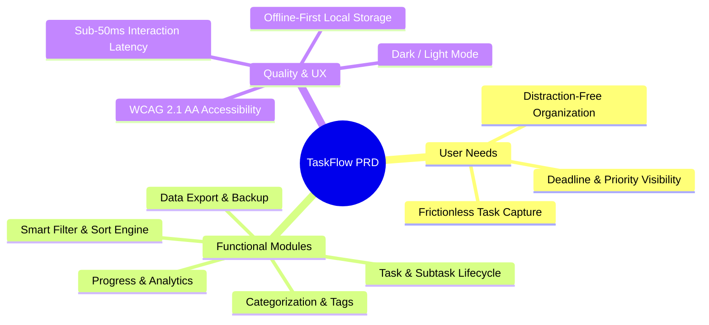
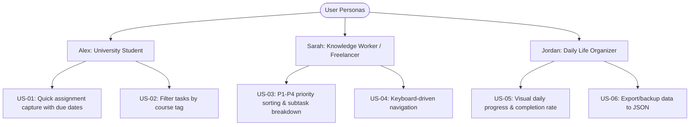
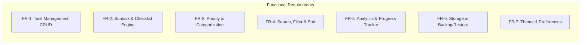
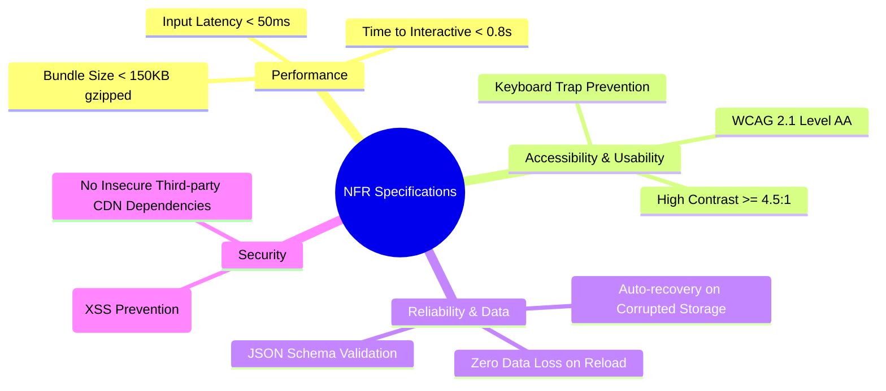
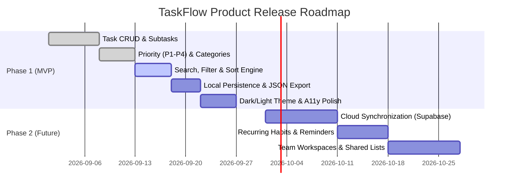

# Product Requirements Document (PRD)
## Product Name: TaskFlow – Modern Smart To-Do & Productivity Application

---

## 1. Document Control & Version History

| Attribute | Details |
| :--- | :--- |
| **Product Title** | TaskFlow (Smart To-Do & Task Management Application) |
| **Document Version** | 1.0.0 |
| **Document Status** | Approved / Baseline |
| **Product Owner** | Product Management Lead |
| **Lead Architect** | Technical Lead |
| **Target Audience** | Engineering, Design, QA, and Stakeholders |
| **Last Updated** | August 2026 |

---

## 2. Product Vision & Executive Summary

**TaskFlow** is a lightweight, responsive, offline-first task management web application built for students, professionals, and daily planners. It solves the friction of disorganized tasks and complex enterprise tools by offering an intuitive, keyboard-first interface, intelligent prioritization (Eisenhower P1–P4), dynamic search/filtering, and instant visual progress feedback.

---

## 3. Problem Statement & Value Proposition

### 3.1 Problem Statement
- **Cognitive Overload:** Users face scattered to-do lists, sticky notes, and complex project tools with steep learning curves.
- **Data Fragility & Slow UIs:** Many web-based apps stall or break without an active internet connection.
- **Lack of Actionable Prioritization:** Basic to-do apps do not provide structured urgency/importance hierarchies or deadline awareness.

### 3.2 Value Proposition
- **Fast & Focused Capture:** Add tasks in seconds with keyboard shortcuts and natural inputs.
- **Structured Urgency:** Eisenhower-style priority tags (P1 Urgent to P4 Low) and smart due-date sorting.
- **Always Available:** Complete offline-first resilience with automated local storage synchronization.
- **Delightful & Accessible:** Modern ergonomic UI with full WCAG 2.1 AA accessibility and smooth dark/light theming.

---

## 4. User Personas & User Stories

### 4.1 User Personas
1. **Alex (University Student):** Juggling classes, assignments, and extracurriculars. Needs fast deadline tracking and course-based tags.
2. **Sarah (Knowledge Worker / Freelancer):** Managing multiple client deliverables. Needs priority matrices (P1–P4), subtasks, and distraction-free task management.
3. **Jordan (Daily Organizer):** Tracking daily habits and household chores. Needs satisfying visual progress indicators and offline capability.

### 4.2 Core User Stories & Acceptance Criteria

| ID | User Story | Acceptance Criteria |
| :--- | :--- | :--- |
| **US-01** | *As a user, I want to quickly add a task with a title, priority, category, and due date so that I can capture to-dos with minimal friction.* | • Task appears immediately in the active list. • Title is mandatory; other fields are optional. • Pressing `Enter` adds the task and clears the input. |
| **US-02** | *As a user, I want to toggle task completion with a single click so that I can track what is finished.* | • Clicking the checkbox toggles completion status. • Completed tasks show strike-through text and update progress stats. • Action can be toggled back at any time. |
| **US-03** | *As a user, I want to break large tasks into subtasks with checklist items so that I can tackle complex work step-by-step.* | • Subtasks can be added/checked off independently within a task. • Parent task card shows subtask completion ratio (e.g. `2/3`). |
| **US-04** | *As a user, I want to filter and search tasks in real-time so that I can immediately find what I need.* | • Instant debounced search on title and description. • Filter by status (*All, Active, Completed*), priority (*P1–P4*), and categories. |
| **US-05** | *As a user, I want my data to persist across browser reloads and offline sessions so that I never lose my tasks.* | • Changes persist to `localStorage` / `IndexedDB` automatically. • Works 100% offline without network dependency. |
| **US-06** | *As a user, I want to switch between Dark and Light mode so that I have an eye-friendly viewing experience.* | • Theme toggles smoothly and remembers user preference. |
| **US-07** | *As a user, I want to export and import my task data as a JSON file so that I can backup or migrate my data.* | • One-click JSON download. • JSON file upload with validation and rollback on error. |

---

## 5. Functional Requirements (FR)

### FR-1: Task Management (CRUD)
- **FR-1.1:** System shall allow users to create tasks with Title (1–250 chars), Description (optional markdown/plain text), Due Date & Time, Priority, and Category.
- **FR-1.2:** System shall allow inline and modal editing of existing tasks.
- **FR-1.3:** System shall allow deleting individual tasks with an undo toast confirmation.
- **FR-1.4:** System shall support bulk actions: "Mark All as Completed" and "Clear Completed Tasks".

### FR-2: Subtasks & Decomposition
- **FR-2.1:** Each task shall support an arbitrary list of subtasks (checklist items).
- **FR-2.2:** Completing all subtasks shall not automatically complete the parent task unless configured by the user, but will display `100%` subtask completion.

### FR-3: Priorities & Categorization
- **FR-3.1:** System shall provide four predefined priority tiers:
  - **P1 (Urgent / High Impact):** Red badge
  - **P2 (High Priority):** Amber badge
  - **P3 (Medium Priority):** Blue badge
  - **P4 (Low / None):** Muted slate badge
- **FR-3.2:** System shall support default categories (*Work, Study, Personal, Health*) and allow adding custom categories with distinct colors.

### FR-4: Real-time Search, Filtering & Sorting
- **FR-4.1:** Search bar shall filter tasks by title and description matching with a debounced delay of `≤ 250ms`.
- **FR-4.2:** Filter tabs shall support: *All*, *Active (Incomplete)*, and *Completed*.
- **FR-4.3:** Sorting options shall include:
  - Due Date (Earliest first / Latest first)
  - Priority (P1 → P4)
  - Creation Date (Newest first / Oldest first)
  - Alphabetical (A → Z)

### FR-5: Productivity Metrics & Progress Bar
- **FR-5.1:** Header shall display real-time metrics: Total Tasks, Completed Count, Incomplete Count, and Overdue Count.
- **FR-5.2:** Visual animated progress bar displaying `% Completed = (Completed / Total) * 100`.

### FR-6: Persistence, Backup & Restore
- **FR-6.1:** All task state changes shall be saved immediately to browser client-side storage.
- **FR-6.2:** System shall provide "Export Data (JSON)" to download the complete task dataset.
- **FR-6.3:** System shall provide "Import Data (JSON)" with strict schema validation to restore or merge tasks.

### FR-7: UI Customization & Accessibility
- **FR-7.1:** Support Dark Mode and Light Mode with system OS preference detection.
- **FR-7.2:** Full keyboard navigation support (e.g. `Ctrl+K` for search, `Enter` to submit, `Esc` to close modal).

---

## 6. Non-Functional Requirements (NFR)

| ID | Requirement Category | Specification / Threshold |
| :--- | :--- | :--- |
| **NFR-01** | **Performance (Latency)** | UI interactions (add, check, delete, filter) must update in `< 50ms`. |
| **NFR-02** | **Performance (Load Time)** | First Contentful Paint (FCP) `< 0.8s`; Time to Interactive (TTI) `< 1.0s`. |
| **NFR-03** | **Accessibility (a11y)** | Strict compliance with **WCAG 2.1 Level AA** standards and full keyboard navigation. |
| **NFR-04** | **Browser Compatibility** | Chrome, Edge, Firefox, Safari, and major mobile web browsers (iOS/Android). |
| **NFR-05** | **Security & Sanitization** | All text inputs sanitized against XSS attacks; zero execution of unsanitized HTML. |
| **NFR-06** | **Reliability & Resilience** | Client-side state must survive app crashes, page refreshes, and network loss. |

---

## 7. Scope & Release Phases

### 7.1 In-Scope (Phase 1 / MVP)
- Core Task CRUD, Subtask checklists, Priority tags (P1–P4), Category assignment.
- Search, Filter by status/category, Multi-criteria sorting.
- Real-time productivity metrics & progress bar.
- Offline `localStorage`/`IndexedDB` persistence with JSON import/export.
- Dark & Light mode toggle with responsive mobile layout.

### 7.2 Out-of-Scope (Phase 2 / Roadmap)
- Multi-user real-time collaboration and workspace permissions.
- Direct push notifications via Web Push API / Service Workers.
- Two-way sync with Google Calendar or Apple Reminders.

---

## 8. Success Metrics & Key Performance Indicators (KPIs)

| Metric | Benchmark / Target | Measurement Method |
| :--- | :--- | :--- |
| **Task Creation Speed** | `< 5 seconds` average creation time | Usability testing / timestamp diff |
| **User Task Completion Rate**| `> 65%` of active tasks marked completed | Local analytics summary |
| **Lighthouse Audit Score** | `≥ 95` (Performance, A11y, Best Practices, SEO) | Automated CI/CD Lighthouse audits |
| **Crash & Data Loss Rate** | `0%` data corruption reports | Storage validation unit tests |
| **Test Coverage** | `≥ 85%` statement & branch coverage | Automated Vitest / Jest test reports |

---

## 9. Assumptions, Constraints & Dependencies

### 9.1 Assumptions
- Target users utilize modern web browsers with ES6+ and Web Storage API support.
- Primary initial usage will be individual task tracking on desktop and mobile browsers.

### 9.2 Constraints
- Initial MVP operates client-side without requiring mandatory user registration/login.
- Total asset bundle size must remain `< 150 KB` gzipped.

### 9.3 Dependencies
- Browser Web Storage APIs (`localStorage`, `IndexedDB`).
- Modern lightweight icon set (e.g. Lucide / SVG icons).
