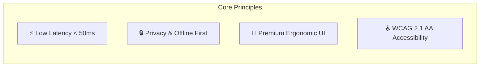
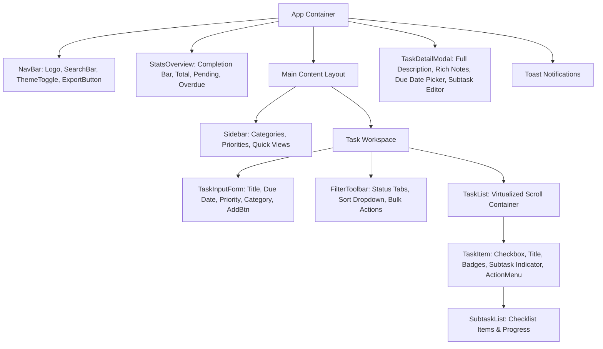
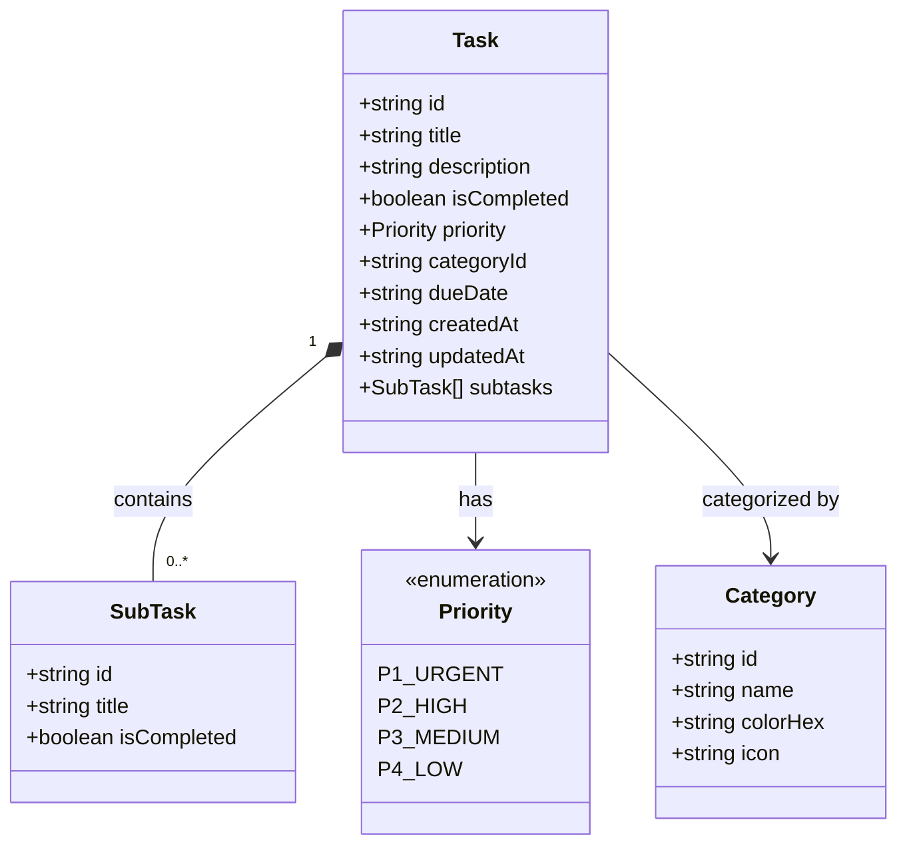
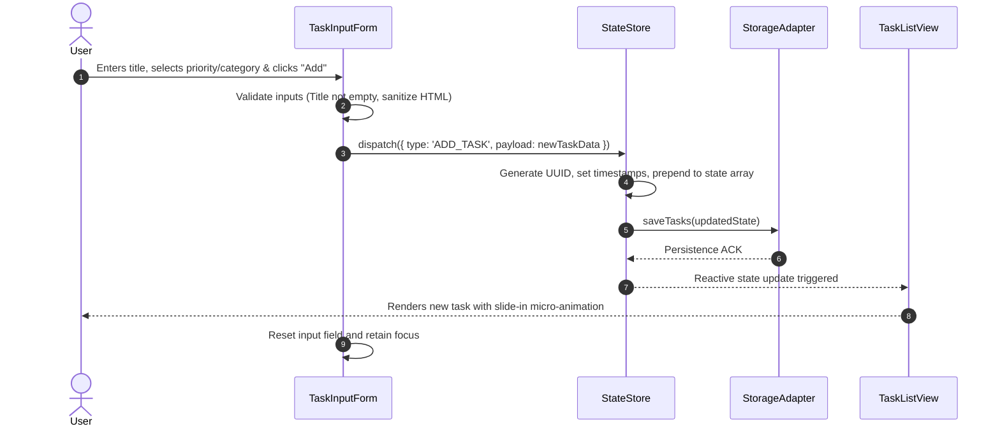
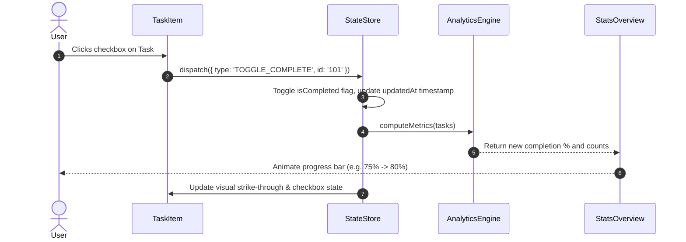
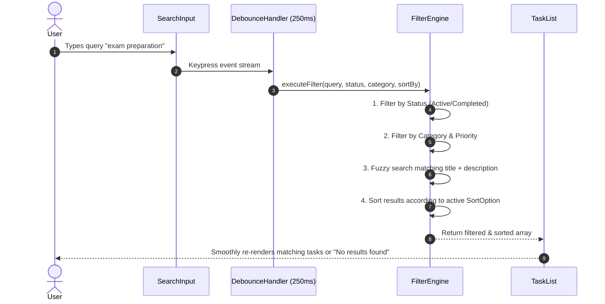
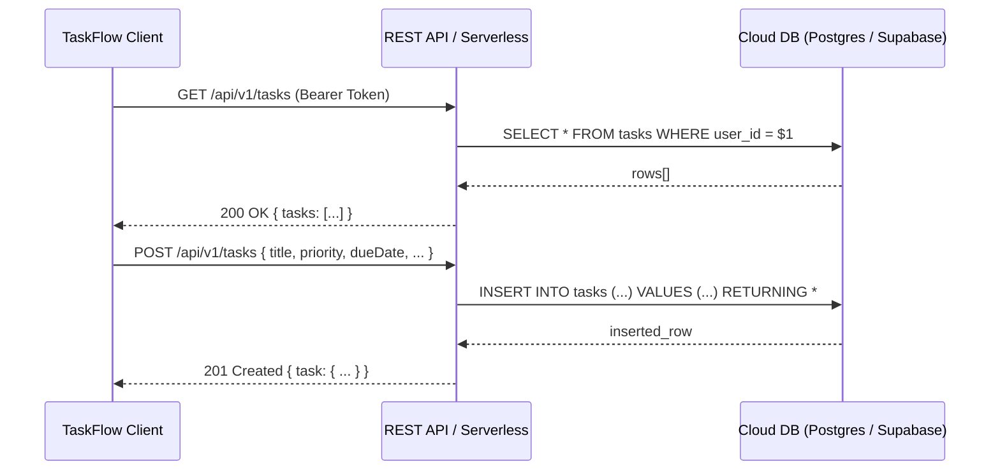
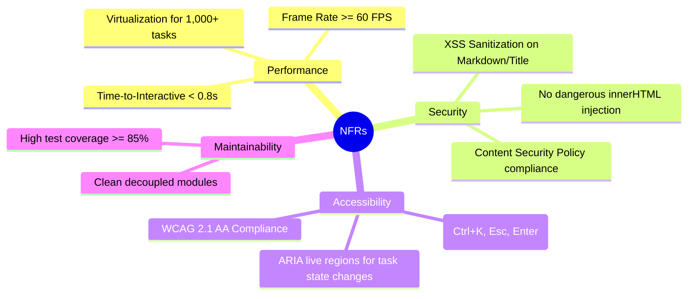
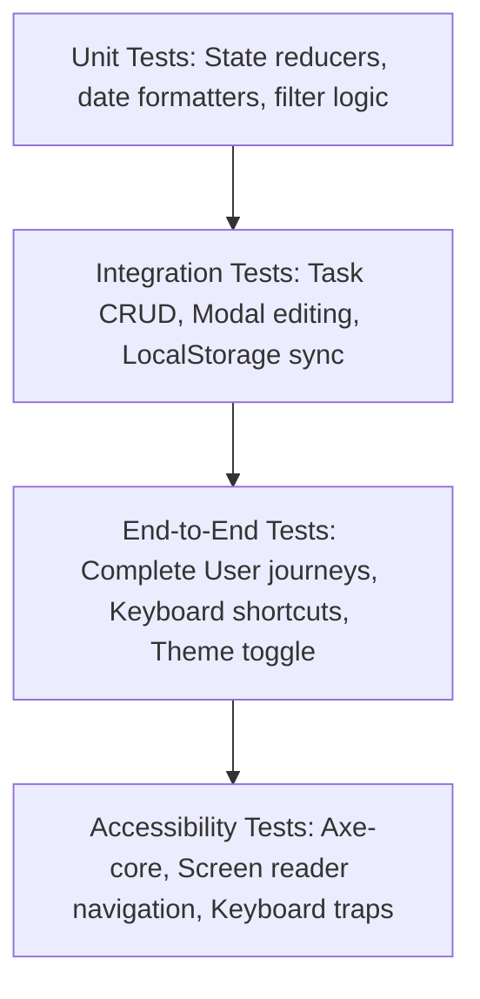

# Technical & System Design Document (design.md)
## System Name: TaskFlow – Smart To-Do & Productivity Web Application

---

## 1. System Overview & Core Principles

**TaskFlow** is an offline-first, highly responsive, modern task management application engineered for speed, visual clarity, and robust productivity workflows.



### Core Design Principles
1. **Zero-Lag Responsiveness:** All UI interactions update optimistically in `< 50ms`.
2. **Offline-First Resilience:** Client is the source of truth with automated background persistence to `localStorage` / `IndexedDB`.
3. **Ergonomic Information Architecture:** Prioritization by visual hierarchy, Eisenhower matrix tagging, and quick keyboard navigation.
4. **Resilient Data Integrity:** Immutable state updates, strict schema validation, and fail-safe JSON backup/restore.

---

## 2. High-Level System Architecture

TaskFlow adopts a modular, component-driven client architecture with a decoupled storage adapter layer to enable seamless migration between browser storage and cloud backends.

```mermaid
flowchart TB
    subgraph Presentation Layer [Presentation & View Layer]
        UI[App Shell / UI Views]
        Header[Header & Quick Stats]
        InputBar[Task Creation Input & Voice/Fast Capture]
        Filters[Filter, Search & Sort Toolbar]
        List[Virtual Task List & Item Cards]
        Modal[Task Details & Subtasks Modal]
        Toast[Toast / Notification System]
    end

    subgraph State Layer [State Management Layer]
        Store[Task State Store (Reactive / Reducer Pattern)]
        FilterEngine[Search & Query Filtering Engine]
        AnalyticsEngine[Progress & Completion Calculator]
        ThemeEngine[Theme & Preference Controller]
    end

    subgraph Persistence Layer [Storage & Adapter Layer]
        Adapter{Storage Adapter Interface}
        LocalStorage[Local Storage / IndexedDB Provider]
        ExportService[JSON Export / Import Service]
        SyncEngine[Optional Remote REST / Supabase Sync Adapter]
    end

    UI --> Store
    Header --> AnalyticsEngine
    InputBar --> Store
    Filters --> FilterEngine
    List --> Store
    Modal --> Store
    Toast --> Store

    Store --> FilterEngine
    Store --> AnalyticsEngine
    Store --> Adapter

    Adapter --> LocalStorage
    Adapter --> ExportService
    Adapter --> SyncEngine
```

---

## 3. Component Hierarchy & Flow



### Component Breakdown & Responsibilities

| Component Name | File Responsibility | Key Props / State |
| :--- | :--- | :--- |
| `App` | Top-level layout container, theme class provider, global hotkeys | `theme`, `tasks`, `activeFilter` |
| `NavBar` | Global brand header, fast search trigger, theme switcher, settings | `onSearchChange`, `onThemeToggle` |
| `StatsOverview` | Real-time progress bar, completed/pending/overdue task counts | `totalCount`, `completedCount`, `overdueCount` |
| `TaskInputForm` | Task quick-entry with keyboard support (Enter to submit, Esc to clear) | `onAddTask`, `categories`, `priorities` |
| `FilterToolbar` | Status tabs (*All, Active, Completed*), sorting selector, clear actions | `currentStatus`, `sortField`, `sortOrder` |
| `TaskList` | Renders filtered task collection with empty-state handling and animations | `tasks`, `onToggle`, `onDelete`, `onEdit` |
| `TaskItem` | Individual task card with completion toggle, priority badge, and menu | `task`, `onToggleComplete`, `onSelectTask` |
| `TaskDetailModal` | Deep edit modal for description, subtasks, deadline adjustment | `selectedTask`, `isOpen`, `onSave`, `onClose` |
| `ToastContainer` | Transient feedback alerts for undo, delete, and save actions | `toasts`, `onDismiss` |

---

## 4. Data Models & Schema Design



### 4.1 TypeScript Data Contracts

```typescript
export type PriorityLevel = 'P1' | 'P2' | 'P3' | 'P4';

export interface SubTask {
  id: string;
  title: string;
  isCompleted: boolean;
}

export interface Category {
  id: string;
  name: string;
  colorHex: string;
  icon?: string;
}

export interface Task {
  id: string;
  title: string;
  description?: string;
  isCompleted: boolean;
  priority: PriorityLevel;
  categoryId: string;
  dueDate: string | null; // ISO 8601 string (YYYY-MM-DDTHH:mm:ssZ) or null
  createdAt: string;     // ISO 8601 string
  updatedAt: string;     // ISO 8601 string
  subtasks: SubTask[];
}

export type FilterStatus = 'ALL' | 'ACTIVE' | 'COMPLETED';
export type SortOption = 'DUE_DATE_ASC' | 'DUE_DATE_DESC' | 'PRIORITY_DESC' | 'CREATED_DESC' | 'TITLE_ASC';

export interface TaskFilterState {
  searchQuery: string;
  status: FilterStatus;
  categoryId: string | null;
  priority: PriorityLevel | null;
  sortBy: SortOption;
}
```

---

## 5. Core Workflows & Sequence Diagrams

### 5.1 Task Creation Workflow



### 5.2 Task Completion & Progress Calculation Workflow



### 5.3 Real-Time Search & Multi-Filter Query Engine



---

## 6. User Interface & Design System (UI/UX)

### 6.1 Design Tokens & Color System

| Token | Light Mode Value | Dark Mode Value | Usage |
| :--- | :--- | :--- | :--- |
| `--bg-primary` | `#F8FAFC` (Slate 50) | `#0F172A` (Slate 900) | Main background |
| `--bg-surface` | `#FFFFFF` | `#1E293B` (Slate 800) | Cards, Modals, Inputs |
| `--bg-surface-hover`| `#F1F5F9` | `#334155` | Hovered rows, menu items |
| `--text-primary` | `#0F172A` | `#F8FAFC` | Main headings & task titles |
| `--text-secondary` | `#64748B` | `#94A3B8` | Subtitles, dates, counters |
| `--color-accent` | `#6366F1` (Indigo 500) | `#818CF8` (Indigo 400) | Primary buttons, active tabs |
| `--color-success` | `#10B981` (Emerald 500)| `#34D399` | Checkmarks, 100% progress |
| `--priority-p1` | `#EF4444` (Red 500) | `#F87171` | Urgent priority badge |
| `--priority-p2` | `#F59E0B` (Amber 500) | `#FBBF24` | High priority badge |
| `--priority-p3` | `#3B82F6` (Blue 500) | `#60A5FA` | Medium priority badge |
| `--priority-p4` | `#94A3B8` (Slate 400) | `#64748B` | Low / None priority |

### 6.2 Responsive Layout Wireframe Structure

```
+-----------------------------------------------------------------------------------+
|  [Logo] TaskFlow          [ 🔍 Search tasks... (Ctrl+K) ]   [ 🌓 Theme ] [ 💾 Export ]|
+-----------------------------------------------------------------------------------+
|  PROGRESS: [=========================>              ] 65%  (13/20 Completed)     |
+------------------------+----------------------------------------------------------+
|  CATEGORIES & VIEWS    |  +----------------------------------------------------+  |
|  📁 All Tasks     (20) |  | ➕ What do you need to do?  [📅 Due] [⭐ P1] [ Add ]|  |
|  ⭐ Urgent (P1)     (4) |  +----------------------------------------------------+  |
|  💼 Work           (8) |                                                          |
|  🎓 Study          (5) |  [ All ] [ Active (7) ] [ Completed (13) ]  Sort: [Due Date ▾]|
|  🏠 Personal       (3) |  ------------------------------------------------------  |
|                        |  [ ] Finish CS201 Assignment      [🎓 Study] [⭐ P1] [Today]|
|                        |      - Subtasks (2/3) [👁️ Edit] [🗑️ Delete]             |
|                        |  [ ] Prepare sprint review slides  [💼 Work]  [⭐ P2] [Tomorrow]|
|                        |  [x] Buy groceries & meal prep     [🏠 Personal] [P4] [Done]|
+------------------------+----------------------------------------------------------+
```

---

## 7. Storage Strategy & Data Resilience

### 7.1 Local Storage Adapter Interface
All persistence operations are executed through an asynchronous storage adapter interface:

```typescript
export interface IStorageAdapter {
  loadTasks(): Promise<Task[]>;
  saveTasks(tasks: Task[]): Promise<boolean>;
  loadCategories(): Promise<Category[]>;
  saveCategories(categories: Category[]): Promise<boolean>;
  exportData(): Promise<string>; // JSON dump
  importData(jsonData: string): Promise<boolean>;
  clearAll(): Promise<boolean>;
}
```

### 7.2 Fault Tolerance & Schema Migrations
- **Auto-Recovery:** If storage payload is corrupted, TaskFlow loads default starter tasks and creates a timestamped recovery backup.
- **Version Tagging:** The stored schema includes a `_schemaVersion: 1` field to facilitate automatic migrations if future attributes are added.
- **Export/Import Guardrails:** JSON imports are validated against a strict schema validator before replacing active memory state.

---

## 8. API & Cloud Synchronization Specification (Phase 2 Ready)

For future cloud backup and multi-device sync, the following RESTful contract is established:



### REST Endpoint Matrix

| Method | Endpoint | Description | Expected Payload | Response Status |
| :--- | :--- | :--- | :--- | :--- |
| `GET` | `/api/v1/tasks` | Fetch all tasks for user | None | `200 OK` |
| `POST` | `/api/v1/tasks` | Create a new task | Task entity (minus id) | `201 Created` |
| `PUT` | `/api/v1/tasks/:id`| Full/Partial update of a task | Partial<Task> | `200 OK` |
| `DELETE`| `/api/v1/tasks/:id`| Remove a single task | None | `204 No Content` |
| `POST` | `/api/v1/tasks/bulk-delete` | Batch remove completed | `{ ids: string[] }` | `200 OK` |

---

## 9. Non-Functional Requirements (NFRs)



1. **Performance:**
   - Instant DOM rendering with virtual scrolling for task counts `> 500`.
   - Debounced search queries (`250ms`) to minimize re-renders.
2. **Security:**
   - Strict input sanitization prevents Cross-Site Scripting (XSS) in task titles and notes.
   - Zero external tracking scripts or insecure dependencies.
3. **Accessibility (a11y):**
   - Full keyboard accessibility: Focus states, tab orders, `aria-expanded`, `aria-checked`, and `aria-live` announcements for task additions/completions.
   - Contrast ratio `≥ 4.5:1` for normal text across light and dark themes.

---

## 10. Quality Assurance & Testing Strategy



### Test Coverage Plan
- **Unit Tests (Vitest / Jest):** Test pure functions, priority sorting, date difference utilities, and state reducers.
- **Integration Tests:** Verify that modifying subtasks updates parent progress correctly and syncs with `IStorageAdapter`.
- **E2E Tests (Playwright / Cypress):** Validate user flows: Creating task -> Setting due date -> Filtering by tag -> Marking completed -> Exporting JSON.
- **Accessibility Testing:** Automated Axe linter checks integrated into CI/CD build pipelines.

---

## 11. Traceability Matrix (PRD to Design Mapping)

| PRD Requirement ID | PRD Feature Description | Technical Component in `design.md` | Section Reference |
| :--- | :--- | :--- | :--- |
| **FR-1** | Task CRUD Operations | `TaskInputForm`, `TaskList`, `StateStore` | Section 3 & 5.1 |
| **FR-2** | Subtask & Checklist Engine | `SubTask` schema, `SubtaskList`, `TaskDetailModal` | Section 4.1 & 5.2 |
| **FR-3** | Priority Matrix & Categories | `PriorityLevel`, `Category` schema, Badges | Section 4.1 & 6.1 |
| **FR-4** | Real-time Search & Filter | `FilterEngine`, `DebounceHandler` | Section 5.3 |
| **FR-5** | Progress & Analytics Bar | `AnalyticsEngine`, `StatsOverview` | Section 3 & 5.2 |
| **FR-6** | Offline Persistence & Export | `IStorageAdapter`, `LocalStorage`, `ExportService` | Section 7.1 & 7.2 |
| **FR-7** | Dark/Light Mode & A11y | Design Tokens, Keyboard Navigation, ARIA | Section 6.1 & 9 |
